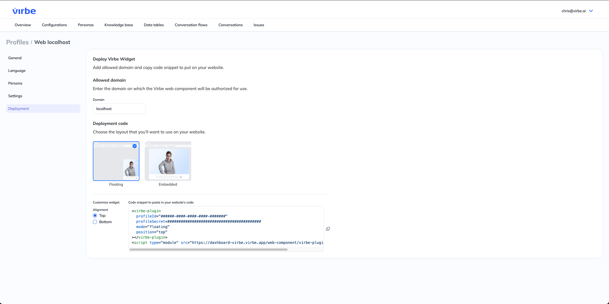
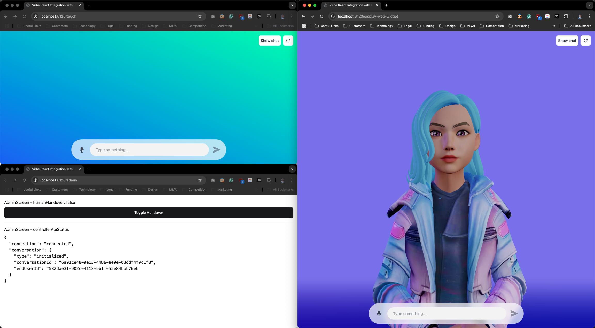

# Virbe React Integration Sample for multiple screens

This sample demonstrates how to integrate Virbe with a React application that has multiple screens eg. separate Display and Control screens.
You can switch between Display, Control and Admin screen - for best experience, use 3 separate browser widows. This sample uses LocalStorage to synchronize state between browser windows.

## Getting started
1. Install dependencies
```bash
npm install
```
2. Create and configure Web Widget Profile in Virbe Dashboard eg. https://dashboard-virbe.virbe.app (<your-dashboard-url>)

3. Create `.env` file eg. copy .env.sample and fill in ProfileId, ProfileSecret and Dashboard URL (from step 1)
4. Start the application
```bash
npm run dev
```


## Testing
1. Open 3 browser windows:
   - Touch Control: http://localhost:6120/touch
   - Admin: http://localhost:6120/admin
   - Display (Web Avatar): http://localhost:6120/display-web-widget
   - Display (Kiosk Pixel Stream): http://localhost:6120/display-kiosk-streaming
     - Requires that you create and Virbe Kiosk Profile  
     - Download and install [Virbe Metahuman Kiosk app](https://docs.virbe.ai/digital-signage/kiosk-apps/metahuman-kiosk)
     - Launch Virbe Signaling server using Docker Compose (check below for instructions)
     - Alias `virbe-signaling.local` the signaling server to `127.0.0.1` in your hosts file eg. `/etc/hosts` file



2. Switch to Human Handover to simulate a video handover on the Control and Display screens

## Lanching Virbe Signaling Server
```bash
cd ../signaling-server
docker compose up -d
```

## Launching Virbe Metahuman Kiosk in Pixel Streaming mode
1. Download and install [Virbe Metahuman Kiosk app](https://docs.virbe.ai/digital-signage/kiosk-apps/metahuman-kiosk)
2. Launch the Kiosk app using the following command, connecting it to your signaling server
```bash
./kiosk.exe -AudioMixer -PixelStreamingURL=ws://127.0.0.1:8888 -RenderOffscreen SettingsUrl="<your-kiosk-profile-configuration-url>"
# Make sure to use quotes "" around your configuration URL
```
3. Test connection using the provided Pixel Streaming integration http://localhost:6120/display-kiosk-streaming 
